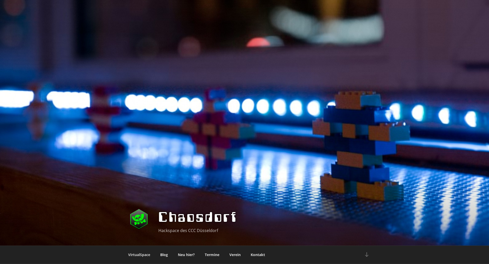

# twenty-seventeen-child
our modifications to Wordpress' Twenty Seventeen Theme

This is the theme powering [chaosdorf.de](https://chaosdorf.de).

Is is based on the [main Wordpress Twenty Seventeen theme](https://wordpress.org/themes/twentyseventeen/)
but with three modifications:

 * the color scheme changes automatically based on `prefers-color-scheme`
 * we use Open Sans as the main font
 * the columns for static pages without a sidebar are wider
